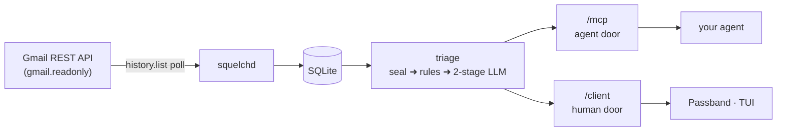

<div align="center">

# 🎚️ squelch

**Local-first email intelligence for your AI agent.**

squelch reads your Gmail (read-only), decides what actually deserves attention, catches bills and deadlines, and serves that intelligence over MCP to an agent you already run. Your agent never holds your Gmail credential and never gets raw access to your mailbox.

[](https://github.com/braelyn-ai/squelch/actions/workflows/release-daemon.yml)
[](LICENSE)
[](Cargo.toml)
[](deploy/DOCKER.md)

[Quickstart](#quickstart) ·
[How it works](#how-it-works) ·
[Agent door](#the-agent-door) ·
[Passband](#passband-the-macos-client) ·
[Security](#security-posture) ·
[Docs](#docs)

</div>

---

The name comes from the radio control that mutes everything below a signal threshold. Same idea here: noise stays below the squelch line, signal (the passband) comes through.

## Features

|     |     |
| --- | --- |
| 🚪 **Two doors, one daemon** | Agents get `/mcp`: ranked reads, no send/archive/delete. Humans get `/client`: bearer-authed search, threads, rules, and gated actions. |
| 🔐 **Sealed auth mail** | 2FA codes, password resets, and login alerts are sealed at ingest. They never reach an LLM, an MCP response, or a list endpoint. |
| ⚖️ **Deterministic first, models second** | Seal detection, then your sender rules, then heuristics. LLMs only refine. |
| 💬 **Natural-language sender rules** | "only tell me about school closures" is a rule. Your words are passed to the model verbatim, in either polarity. |
| 📅 **Bills, deadlines, shipments** | Extracted during triage and queryable as first-class tools. |
| 🖥️ **Native clients** | Passband, a native macOS app over the human door, plus a ratatui TUI for setup and debugging. |
| 📬 **Opt-in read receipts** | Per-send open tracking whose records live in your daemon, not on shared infrastructure. |
| 🐳 **Self-host in one compose file** | Prebuilt multi-arch images on GHCR. No Rust toolchain on the box. |

## How it works



- **Sync**: polls Gmail every 45s with a read-only token. Sent mail seeds a "people I know" contact list, the strongest cheap triage signal.
- **Triage**: seal detection runs before anything else, so auth mail never reaches any LLM. Everything else gets a real model verdict: heuristics (bills, known contacts, alerts, newsletters, cold sales) write provisional seed values at ingest, then Stage-1 (default `claude-opus-5` at low effort) scores importance, tier, deadline, category, and a one-liner with a per-property "why". Those heuristics never stand as the answer unless the API is unreachable, and they never fire a notification on their own; what they do instead is act as a witness, because a model verdict that contradicts them is one of the strongest signals that a row needs a second look.
- **Escalation**: a router, not the model's own confidence, decides what gets that second look. It reads the settled verdict plus facts the model cannot see: what the deterministic detectors found, whether you have corrected this sender before, and where the score fell against the surface line. Stage-2 runs the *same* model at `xhigh` effort with more context (why it was flagged, the sender's track record, the rest of the thread) — escalation buys thinking and information, not a bigger brain. Your squelch/surface rules still settle visibility outright, applied over the verdict rather than instead of it.
- **Re-triage**: relevance expires. Alongside each verdict the model lists dates to look again ("this reservation is dead the morning after"), anything with a deadline schedules itself regardless, and anything sitting unactioned in the standing band gets swept. Verdicts you have corrected by hand are never re-evaluated.
- Each stage has its own daily budget caps and cost ledger; no API key or an exhausted budget just means rows keep their heuristic values.
- **Two doors**: agents connect to `/mcp` and get ranked summaries, and they cannot send, archive, delete, or see auth-related mail. Your own clients connect to `/client` with a bearer token and get search, threads, sender rules, the sitrep lifecycle, and gated actions (archive, label, send) backed by a separate write-scoped credential that only the action handlers can load.

## Quickstart

One-click start with our hosted service: [passband.app](https://passband.app)

Download the client and follow the instructions.

## Self-Hosting

Email is sensitive. Don't want to give it to us? Self-hosting has first-class support. Everything available in the hosted version is available to self-host.

> 🐳 **Prefer Docker?** Prebuilt images live at `ghcr.io/braelyn-ai/squelchd` (amd64 + arm64). [`deploy/DOCKER.md`](deploy/DOCKER.md) is the compose-file-and-env-vars path, no toolchain needed. And [`docs/GETTING-STARTED.md`](docs/GETTING-STARTED.md) walks a full setup end to end: daemon in Docker on a NAS, Passband on a Mac.

### 1. Create a Google Cloud OAuth client

1. Go to [console.cloud.google.com](https://console.cloud.google.com), create a project
2. Enable the **Gmail API** for the project
3. Configure the OAuth consent screen (External), add yourself as a test user
4. Create credentials: OAuth client ID, type **Desktop app**

### 2. Configure

Create a `.env` in the repo root (it is gitignored). Generate the API token
once, into the file — if you write the `$(...)` into `.env` itself, every
`source` mints a fresh token and yesterday's clients all start seeing 401:

```sh
cat > .env <<EOF
SQUELCH_CLIENT_ID=<your client id>
SQUELCH_CLIENT_SECRET=<your client secret>
SQUELCH_ACCOUNT_EMAIL=you@gmail.com
SQUELCH_API_TOKEN=$(openssl rand -hex 32)
EOF
```

`SQUELCH_API_TOKEN` is an optional master password for the human door. Without
it the door still serves and 401s everything until a device has its own token:
`squelchd pair` prints a short code (and a `passband://pair` link) that Passband
trades for one, and `squelchd token list` / `squelchd token revoke <id>` manage
them one device at a time. Keep a master token if you want a way in that survives
revoking every device.

Optional: `SQUELCH_DB_PATH` (default `~/.local/share/squelch/squelch.db`), `SQUELCH_BIND` (default `127.0.0.1:8848`), `SQUELCH_POLL_SECS` (default 45), `SQUELCH_MCP_ALLOWED_HOSTS` if you front the server with a proxy like `tailscale serve`, `SQUELCH_CRED_BACKEND` (`keyring` on macOS, `file` on Linux) and `SQUELCH_CREDENTIALS_PATH` (default `~/.config/squelch/credentials.json`) for the file backend.

`SQUELCH_METRICS_BIND` (unset by default, e.g. `127.0.0.1:9464`) opens a second listener serving Prometheus text metrics at `/metrics`: sync timestamps, Gmail error counts, LLM spend, store sizes. **That listener is plaintext and unauthenticated**, by design, because a scrape credential in a Prometheus config is its own problem. Bind it to loopback or to a private interface and let your collector reach it there; never bind it to a public one. Leave it unset and the daemon opens no such port at all.

To turn on LLM triage, provide an API key: `ANTHROPIC_API_KEY`, `OPENAI_API_KEY`, or the explicit `SQUELCH_STAGE2_API_KEY` (provider sniffed from the key prefix). Both stages share the one key; without a key, triage runs heuristic-only. Models, prices, and budgets are tunable under `[stage1]` / `[stage2]` in `~/.config/squelch/config.toml` or via `SQUELCH_STAGE1_*` / `SQUELCH_STAGE2_*` env vars, and the daily caps can be changed at runtime (no restart) from Passband's Settings.

### 3. Authorize and run

```sh
set -a; source .env; set +a

cargo run --bin squelchd -- auth     # one-time browser consent; token -> macOS keyring, mode-0600 JSON file on Linux
cargo run --bin squelchd -- serve    # sync + both doors on one port
```

Write scopes are a separate, later opt-in: `squelchd auth --write` (only needed for archive/send actions). It runs two consent flows, minting the write credential and re-minting the read one, so the two slots stay in sync.

<details>
<summary><b>Headless box</b> (SSH port-forward)</summary>

Use `squelchd auth --headless` and forward the consent port: `ssh -L 8847:127.0.0.1:8847 yourbox`.

</details>

<details>
<summary><b>No browser can reach the box at all</b> (docker on a NAS, a VPS): export/import</summary>

Consent runs on a machine that *does* have a browser, and the resulting token moves to the daemon:

```sh
# on your laptop, where the browser is:
squelchd auth --export --out cred.txt          # add --write for both credentials

# on the daemon's host:
docker exec -i squelchd squelchd auth --import < cred.txt
```

`--export` runs the normal consent flow and stores nothing. `--out` writes the one line it produces as mode 0600, which a `> cred.txt` redirect cannot do: that takes your umask, and the file is a live refresh token. (Without `--out` the line goes to stdout and everything else to stderr, so `umask 077; squelchd auth --export > cred.txt` also works.)

`--import` reads that line from stdin only (never an argument: arguments show up in `ps` and in shell history). Before it stores anything, it refreshes every credential in the blob against this host's OAuth client, asks Google which mailbox the result opens, and checks the granted scopes cover what each entry's slot requires — a floor, not an exact match, because Google unions grants across one project's consents. A blob is unsigned JSON, so what it says about itself is a claim; a wrong mailbox or a token that cannot do its slot's job is refused, and one bad entry stores none of them. What keeps the two credentials apart is which code path may load each slot, not a capability difference in the tokens. Delete `cred.txt` once it is in.

Both machines must use the same `SQUELCH_CLIENT_ID` and `SQUELCH_CLIENT_SECRET`. A refresh token is bound to the OAuth client that minted it, not to a host, so it travels fine between machines and not at all between clients.

If the laptop side is itself the published container image, run the export inside it with `-p 8847:8847` and add `--expose-consent-listener`: a listener on the container's own `127.0.0.1` is unreachable from your browser. That opens the port on every interface for the length of one consent, so it is opt-in.

There is a `--broker` flag that moves the code instead of the token, and it is a dead end you should not spend time on: Google only lets a Desktop-type OAuth client redirect to loopback, so a consent relay can never receive the code. [docs/BROKER.md](docs/BROKER.md) has the details and the replacement.

</details>

### 4. Connect an agent

Point any MCP client at the streamable HTTP endpoint:

```json
{
  "mcpServers": {
    "squelch": { "type": "http", "url": "http://127.0.0.1:8848/mcp" }
  }
}
```

To reach it from another machine on a tailnet: `tailscale serve --bg 8848`, set `SQUELCH_MCP_ALLOWED_HOSTS=<your-host>.ts.net`, and use the `https://<your-host>.ts.net/mcp` URL.

### 5. Browse locally

```sh
cargo run --bin squelch-tui    # ranked digest, squelch line, sender rule tuning
```

## The agent door

Seven tools, no mailbox writes, sealed mail structurally absent:

| Tool | What it returns |
|---|---|
| `get_inbox_updates` | ranked updates since a timestamp, with importance and a one-line "why" |
| `get_thread` | a full thread by id |
| `search_mail` | full-text search over synced mail |
| `get_deadlines` | upcoming deadlines extracted during triage |
| `get_shipments` | package tracking status |
| `set_sender_rule` | squelch/surface/filter a sender, natural-language `want_text` supported |
| `list_sender_rules` | the current rule set |

Sender rules are the one thing an agent can write, and they only shape triage inside squelch's own database. Nothing an agent does can touch your actual mailbox.

## Passband, the macOS client

[Download here](https://passband.app)

Passband is the native macOS client over the human door: the sitrep, threaded reading, compose with live markdown that sends as proper multipart HTML, contacts autocomplete, per-send read-receipt opt-in, sender rule tuning, sealed-mail reveal with an audit trail, and budget/usage dashboards.

```sh
cd passband
./build.sh          # debug
./build.sh run      # build and launch
./build.sh release  # optimized
```

No Xcode needed for a local build, `swiftc` does the work.

<details>
<summary><b>Code signing notes</b> (why local builds want a Developer ID cert)</summary>

Local builds sign with whatever `Developer ID Application` certificate is in the keychain, falling back to ad-hoc when there is none. That is deliberate and worth knowing about: keychain ACLs match on a bundle's *designated requirement*, and an ad-hoc signature's requirement is a hash of the build itself, so every recompile looks like a new app and re-prompts for access to the stored credentials. A Developer ID requirement is keyed to the team and stays constant across rebuilds. Local builds also get `get-task-allow` so a debugger can attach; it is injected into a throwaway copy of the entitlements and never reaches a release, which the notary service would reject for carrying it.

`VERSION` holds the user-facing version; the build number is the git commit count, so it only ever increases. Override either with `MARKETING_VERSION=` / `BUILD_NUMBER=`.

</details>

<details>
<summary><b>Releases</b> (sign, notarize, staple)</summary>

`./build-release.sh` produces a bundle that opens by double-click on any Mac: Developer ID signature, hardened runtime, Apple notarization, stapled ticket. Ad-hoc builds from `build.sh` do not, Gatekeeper blocks them everywhere but the machine that built them.

```sh
./build-release.sh              # sign, notarize, staple, package
./build-release.sh --no-notary  # sign only; fast, still Gatekeeper-warned
```

It picks up whatever `Developer ID Application` certificate is in the keychain; set `SIGN_ID` to choose explicitly. Notarization needs an **app-specific password** (generated at [appleid.apple.com](https://appleid.apple.com) under Sign-In and Security, *not* your Apple ID password), stored once:

```sh
xcrun notarytool store-credentials squelch-notary \
  --apple-id <your apple id> --team-id <your team id>
```

Override the profile name with `NOTARY_PROFILE=`. Apple's turnaround is typically 2–15 minutes; on rejection the script fetches and prints the reason.

</details>

## Workspace layout

| Component | What it is |
|---|---|
| `squelch-core` | types, SQLite store, seal detection, two-stage triage (rules + LLM), Gmail sync, OAuth |
| [`squelch-mcp`](squelch-mcp/README.md) | the agent door (rmcp server, stdio or HTTP) |
| [`squelch-api`](squelch-api/README.md) | the human door (axum, bearer auth, actions, audit log) |
| `squelch-httpauth` | shared HTTP auth layer used by both doors |
| [`squelchd`](squelchd/README.md) | the daemon binary: `auth`, `run`, `serve` |
| [`squelch-tui`](squelch-tui/README.md) | local ratatui viewer for setup and debugging |
| `passband` | Passband, the native macOS client over the human door |
| [`squelch-relay`](squelch-relay/README.md) | blind APNs ping relay for the future iOS app |
| [`squelch-broker`](squelch-broker/README.md) | consent relay — built but not deployed; see [docs/BROKER.md](docs/BROKER.md) |

## Security posture

- The sync credential is requested as `gmail.readonly`, and what holds the line is structural: sync and triage can only load the Read slot, ever. The write credential (`gmail.modify` + `gmail.send`) lives in a separate slot that is only reachable from the human door's action handlers, which require an explicit confirm flag, run an outbound secret scan on sends, and audit every attempt. (Google unions granted scopes across one project's consents, so the token in the Read slot may *carry* more than readonly after `auth --write` — which door can load which slot is the enforcement, not the token's scope list.)
- Auth emails (2FA codes, password resets, login alerts) are sealed at ingest and never appear in any MCP response, any LLM call, or any list endpoint. Revealing one takes an explicit authenticated request and writes an audit row.
- Email content is treated as untrusted input everywhere. Tokens never appear in logs.
- Read tracking on mail you send is off by default and opt-in per send; the record lives in your daemon, never on shared infrastructure. Self-hosted deployments serve the pixel themselves and need no relay.

The full model is in [docs/SECURITY.md](docs/SECURITY.md).

## Docs

| Doc | Covers |
|---|---|
| [GETTING-STARTED.md](docs/GETTING-STARTED.md) | end-to-end walkthrough: daemon in Docker on a NAS, Passband on a Mac |
| [deploy/DOCKER.md](deploy/DOCKER.md) | prebuilt GHCR images, compose file, env-var config |
| [deploy/DEPLOY.md](deploy/DEPLOY.md) | deployment notes for a Linux server |
| [SECURITY.md](docs/SECURITY.md) | the threat model and the two-door design |
| [SHIPMENTS.md](docs/SHIPMENTS.md) | package tracking: BYOK carrier polling and how a package is identified |
| [TRACKING.md](docs/TRACKING.md) | opt-in read receipts, self-hosted pixel |
| [BROKER.md](docs/BROKER.md) | why the consent broker is a dead end, and what replaced it |

## License

[MIT](LICENSE) © Braelyn Boynton
